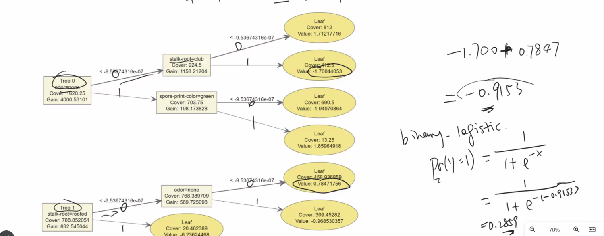
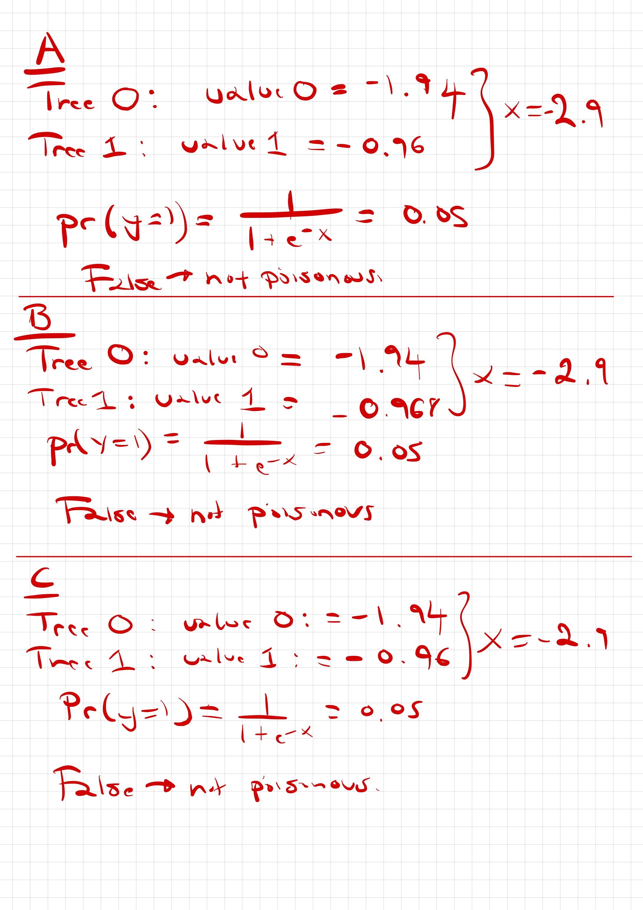

```{r setup, include=FALSE}
knitr::opts_chunk$set(echo = TRUE)
```

The following code loads a dataset on mushroom properties (originally from: http://archive.ics.uci.edu/ml/machine-learning-databases/mushroom/agaricus-lepiota.names) and fits gradient boosted trees

```{r}
library(xgboost)
library(DiagrammeR)
data(agaricus.train, package='xgboost')
data(agaricus.test, package='xgboost')

set.seed(991)

dim(agaricus.train$data)

bst <- xgboost(data = agaricus.train$data, label = agaricus.train$label, 
               max_depth = 2, eta = 1, nthread = 2, nrounds = 2, 
               objective = "binary:logistic")

pred <- predict(bst, agaricus.test$data)

# confusion matrix are useful!
table(Actual = agaricus.test$label, Predicted = pred > 0.5)
```

1. What do `max_depth=2`, `eta=1` and `nrounds=2` do?

- max_depth: the maximum depth of the base decision tree used in xgboost (maximum length from base node to leaves)
- eta: the learning rate of xgboost (gradient descent) where 0 < eta < 1
- nrounds: the maximum number of subsiquentboosted trees 
- objective: depends on the objective of the prediction (i.e possion, binomial)

2. Use `xgb.plot.tree` to draw the tree (it appears in your browser; you need to export/save it from there)

Let's first look at our first observation to better understand xgboost

```{r}
agaricus.test$data[1,]
```

- For observation 1:
  - odor=anise -> odor=none = 0 (False)
  - stalk-root=clud -> club=1 (True)
  - spore-print-colour=brown -> green = 0 (False)
  
Demonstration of first observation on xgboost...

```{r}

```

Same answer as...

```{r}
pred[1]
```


Plotting Tree

```{r}
xgb.plot.tree(model = bst)
```


- The output "value" is the prediction in log function

3. Fit a model with the same options for `max_depth=2` and `eta=1` but with `nrounds` chosen to minimise cross-validation loss.  Use `xgb.plot.tree` to plot it. Comment on the relative accuracy and complexity of the two models

```{r}
xgb_best = xgb.cv(data = agaricus.train$data, label = agaricus.train$label, 
               max_depth = 2, eta = 1, nthread = 2, nrounds = 30, nfold = 5,
               objective = "binary:logistic", metrics = "error")
```

Note: the loss is "logloss", we can use the metric "error" to measure the prediction error for binary classification

The best model appears to be run..... FINISH THIS

```{r}
xgb.cv(data = agaricus.train$data, label = agaricus.train$label, 
               max_depth = 2, eta = 1, nthread = 2, nrounds = 3, nfold = 5,
               objective = "binary:logistic", metrics = "error")
```

```{r}
bst2 = xgboost(data = agaricus.train$data, label = agaricus.train$label, 
               max_depth = 2, eta = 1, nthread = 2, nrounds = 3, 
               objective = "binary:logistic")

xgb.plot.tree(model = bst2)
```


4. Now try lowering the learning rate `eta` to reduce cross-validation loss. (think about a strategy for choosing values of `eta` to try, but don't try more than five or so different ones)

```{r}
for (i in c(0.1, 0.25, 0.5, 0.75, 1.0)) {
  print(i)
  xgb.cv(data = agaricus.train$data, label = agaricus.train$label, 
                 max_depth = 2, eta = i, nthread = 2, nrounds = 10, nfold = 5,
                 objective = "binary:logistic", metrics = "error")
}
```

We looks at smallest errors (dips) of each learning rate to determine the number of iterations/runs we need. Learning rate of 1.0 requires just 3 runs, whereas unsurprisingly the minimum number of runs increases as the learning rate decreases. Learning rate of 0.1 requires 7 runs to get the min error.

5. Data wrangling: the file mushroom.test contains descriptions of three new mushrooms. How does the first model classify their edibility?   *To convert the new data into the correct matrix form, you will need to construct column names as they are in the main data set. The names from the main data can be retrieved using `dimnames(agaricus.train$data)[[2]]`*.

```{r}
# just draw diagram

```

6. The mushrooms are A: *Amanita phalloides*, B: *Amanita virosa*, C: *Volvariella volvacea*. Look up their common names. Comment on the usefulness of the model.

After some research A and B are actually poisonous, however they're both predicted as being not poisonous which is incorrect. C is predicted as non-poisonous and it is non-poisonous in reality which is correct. Not a useful model, probably trained on species in America as opposed to New Zealand.
